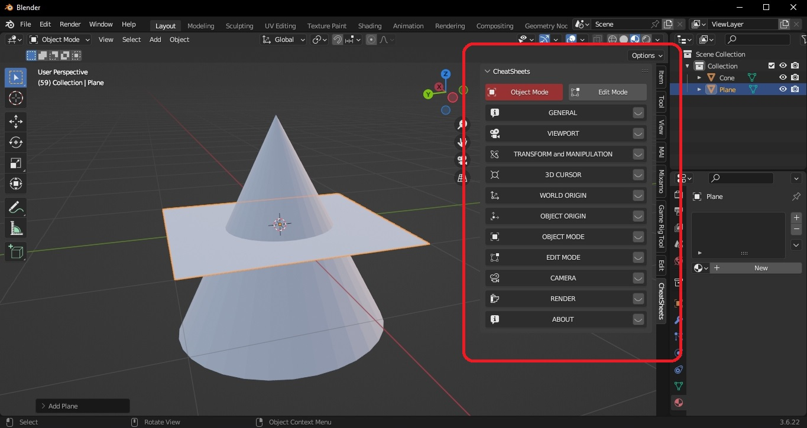
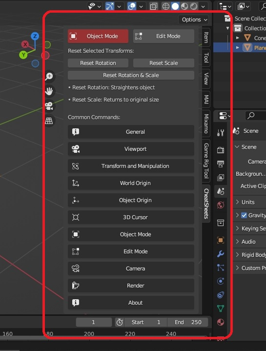
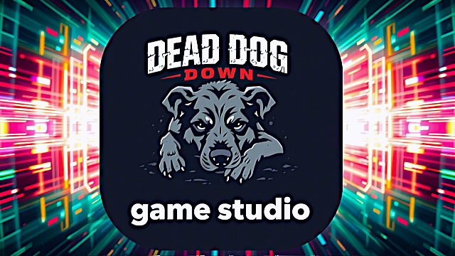

# Blender CheatSheets

A simple and intuitive toolbar designed to help **Blender Creators of all skill levels** access common tools and shortcuts quickly and easily.

## 🧰 Features

- Provides a comprehensive cheatsheet panel inside Blenders 3d view
- You choose whether you want to use Buttons or Shortcuts
- Lists common keyboard, mouse, and numpad shortcuts
- Provides explicit button alternatives for all common commands
- Clean friendly UI panel inside Blender for users of any skill level, especially newbies and intermediates
- Consistency in 3d Language concepts
- Designed for clarity and accessibility
- Commands grouped first by category, then core usage patterns and alpha sorting to find common commands easily
- When in doubt, just click the button and the button will do the job
- Usage of the concept of "Inverse Pairs" to show how functions share a common relationship, example "undo and redo"
- Reduces cognitive load of trying to remember a zillion commands and forgetting what a shortcut combo was
- Less "3d debugging" time - More productive "3d creation" time
- Keeps you in the creative flow - Mega Bonus!
- Perfect visual motif to help in 3D education. No more blind memory and blind guessing
- Compatible with **Blender LTS versions**
- 100% **free and open source**, forever

## Message from an old Granny
I used to spend 40% of my time debugging why a sequence of commands didn't work and only 60% of my time actually modelling 3d stuff.
When I started use BlenderCheatSheets, I could feel the immediate flip. It's like someone turned a light on in a darkened room.
Now I am actually doing 3d modelling and getting 3d stuff done. Much much less 3d debugging... Yay!

## 🖼️ Preview

Here's a quick look at the Blender CheatSheets interface:

## The toolbar you never knew you needed.

## 🖥️ Compatibility

✅ **Currently supports:**

- [Blender 3.6 LTS](https://www.blender.org/download/releases/3-6/ )  
- [Blender 4.2 LTS](https://www.blender.org/download/releases/4-2/ )

This add-on is designed to work with **Blender LTS (Long Term Support)** versions, ensuring stability and long-term usability.
It will probably work on your version of Blender that is a non-LTS, so give it a try.

## 📦 Installation

### Step-by-step:

1. Open **Blender**
2. Go to:  
   `Edit → Preferences → Add-ons`
3. Click:  
   `Install...`
4. Select the downloaded `.zip` file
5. Enable the add-on in the list

---

## 💬 Welcome Message from the Developer

Welcome to Blender CheatSheets

This tool was designed to help 3D Creators of all ages see and access Blender’s common functions in an easy-to-use toolbar.
Transparent and easily accessible even for Newbies, with standard terminology and accessibility to the most common keyboard, mouse, and numpad controls.

Blender CheatSheets is free for life. If you'd like to support us so we can keep this addon up-to-date, please feel free to donate, sponsor, and help fund this addon.

Blender CheatSheets will focus on full compatibility with LTS versions for production usage cases. We will not be following alpha, beta or rc releases, since these are still unpolished versions that we do not wish to break our workflow during production.

Enjoy using Blender with new eyes!

## ❤️ Support Development

This project is free to use and always will be. However, maintaining compatibility with future Blender LTS versions requires time and effort.

If you find this useful and would like to support continued development:

📧 Contact: [deaddogdown.gamestudio@gmail.com](mailto:deaddogdown.gamestudio@gmail.com)  
💸 Funders welcome via email — any amount helps!

## 📜 License

This addon is licensed under the **GNU General Public License v2.0** — same as Blender itself.

You are free to:
- ✅ Use it
- ✅ Share it

With the condition that:
- 🔁 Any derivative work must also remain open source and free of charge and free of conditional access, with no need for login or registration, and no conditions set for the access to this addon, and strictly remain under the same license and give credit to "Dead Dog Down Game Studio" and provide a link back to this github page via github.com/deaddogdown

The 3d language motif designed into this addon remains the sole intellectual property of Dead Dog Down Game Studio and its Creator, and we willingly invite Blender.org to collaborate on the development of this addon as a learning tool in two important areas, firstly general 3d language which is agnostic to any specific 3d vendor, and secondly usage and adoption inside of Blender.

Modern 3d Language has become very mature, but it has been built up on assumptions that only the "in crowd" understand since historically they have had the most exposure. However this becomes a barrier to entry for Newbies seeking to get a sound foundational knowledge of 3d language in general, independent of what 3d program they use. In this addon, implicit assumptions and made explicit, and the most common concepts are exposed early on, to help the user understand the language of 3D design. All users will gain some insight and clarification from the structure of this addon.

We have done our best to group functions in a sequence that fosters precedence, common usage patterns and alpha ordering to reduce brain drain. This is still a mammoth task since modern 3D software is very mature and complex. But what this addon will give you, is a visual reference to work from, combined with buttons and the shortcut commands to get your creative work done.

We do not believe in button shuffling, and strive to keep ui consistency. We will not move buttons around if it simply serves one persons favorite idea of how they want to use the addon. We wish to respect our users, and give them a ui that does not change, so they can spend more time being productive, and less time trying to learn a new layout that wastes time, money and patience. When in production, the tools must just work.

We do not push updates, since we don't believe in software updates during production. That alone is "production suicide". We also do not metric, use your data, violate your trust, or wish to rich off something that is not true to our vision. We give these tools for free, while we work on our games to sell one day. We have no time to build other things that are outside of our core focus, and for this reason we are not a distributor who over-charges you, we are not a reseller who makes you pay with your money, time, and your data. We respect your privacy and that you want to be left alone to do what you do best, with no nags, no lock-in, no spying.

We believe that our reward must come from real work as we bring our games to you when we feel the time is right.

See the [LICENSE](LICENSE) file for full terms.

## 🧑‍💻 Developed by

**DEAD DOG DOWN - GAME STUDIO**

We make tools and games — and love helping creators express themselves through open-source software.

## ™ Disclaimer

"Blender" is a registered trademark of the Blender Foundation.  
This project is **not affiliated with**, endorsed by, or supported by the Blender Foundation or any of its subsidiaries.

The use of the term “Blender” in this project’s name and description is for descriptive purposes only, to indicate compatibility with Blender software.

---

## Legal

All rights reserved. This addon is for public benefit and follows Blender.org license policy of GPLv2 for all perpetuity. No permission is given to publish this addon on any third party store, whether free or paid, without the consent of the creator. If you paid for this addon, were forced to sign up for something, or had to install software to get it, make sure to ask for your money back, delete that account and go GPLv2.

---

